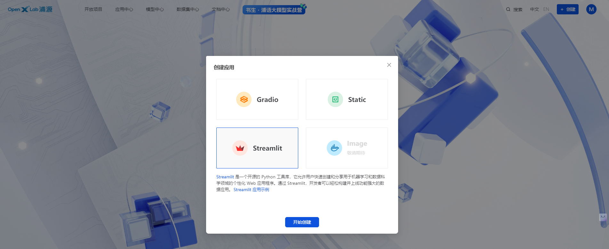
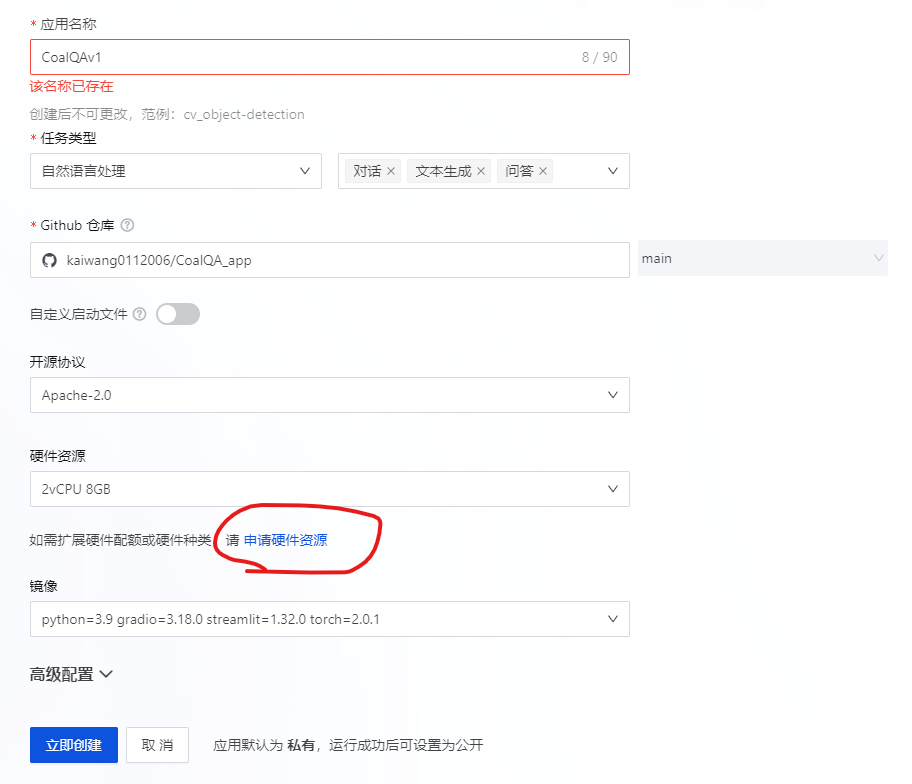

# 1. 直接使用pytorch原生加载streamlit应用

    streamlit run app.py --server.address=127.0.0.1 --server.port 6006

# 2. 在openxlab上部署

- 登陆 OpenXLab，创建 Streamlit 应用

- 选择配置，创建应用，如果需要更多的硬件资源，在这里进行申请

- 等待构建、启动

- 项目体验

